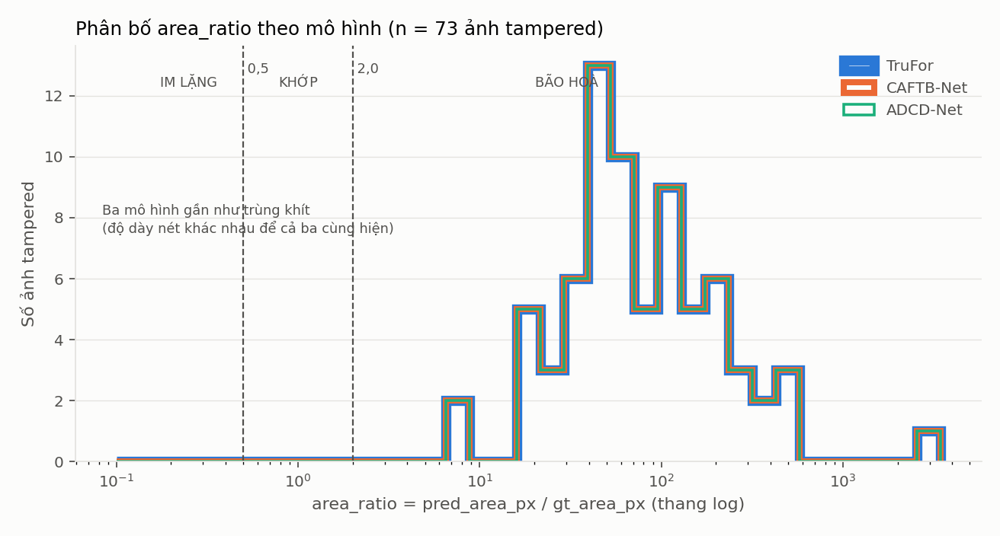
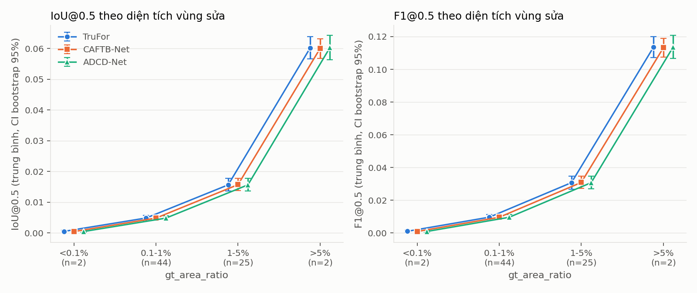
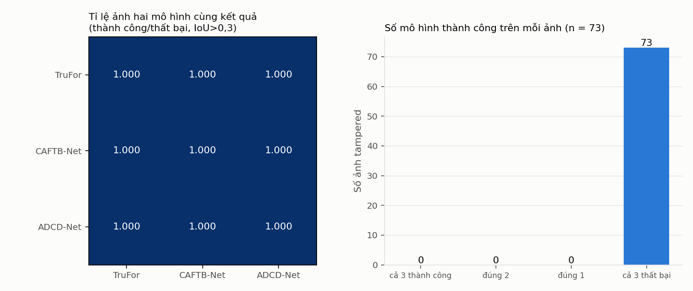
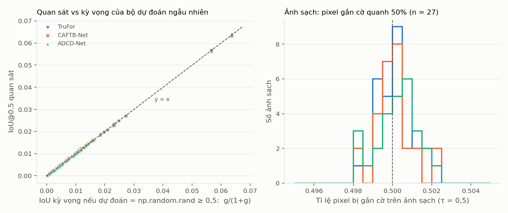

# Phân tích kết quả benchmark zero-shot (TruFor, CAFTB-Net, ADCD-Net)

> **CẢNH BÁO QUAN TRỌNG: file kết quả này không hợp lệ để rút ra bất kỳ kết luận nào về ba mô hình.**
> `forensichub_benchmark_results.csv` không chứa đầu ra của TruFor, CAFTB-Net hay ADCD-Net, và không phải kết quả trên STFD. Toàn bộ số liệu khớp với đầu ra của một bộ dự đoán ngẫu nhiên `np.random.rand(512, 512)` (bằng chứng ở mục G). Các bảng A–F dưới đây vẫn được tính đầy đủ, nhưng chúng mô tả **mức nền của bộ dự đoán ngẫu nhiên**, không mô tả các mô hình.

## Tóm tắt

- **Nguồn dữ liệu sai so với mô tả:** CSV có 300 dòng = 100 ảnh × 3 mô hình, cột `dataset` = `DocTamper` cho cả 300 dòng (không phải STFD); 73 ảnh bị can thiệp, 27 ảnh sạch. Ba hàm mô hình trong [benchmark.py:34-41](benchmark.py#L34-L41) là placeholder `return np.random.rand(512, 512)` với comment "TODO: Thay bằng code gọi model thực tế".
- **Số liệu khớp với bộ dự đoán ngẫu nhiên:** IoU@0.5 quan sát trung bình 0,009953 / 0,009951 / 0,009927 so với kỳ vọng ngẫu nhiên 0,009935; sai lệch tương đối trung vị 1,3–1,8%. Trên ảnh sạch, số pixel bị gắn cờ trung bình 131 062,8 / 131 089,3 / 131 137,4, so với kỳ vọng nhị thức 131 072 ± 256.
- **Kết quả gần như giống hệt nhau giữa ba mô hình:** mọi khoảng tin cậy chồng lên nhau; McNemar không tính được (0 cặp bất đồng, cả 73 ảnh đều thất bại ở cả ba mô hình). Không có chênh lệch nào có ý nghĩa thống kê.
- **Ba giả thuyết của nhóm không kiểm chứng được** bằng dữ liệu này (mục "Giả thuyết"). Số liệu chỉ cho thấy đúng một điều: một bộ dự đoán ngẫu nhiên có FPR mức ảnh 100% và 100% ảnh ở chế độ BÃO HOÀ.
- **Việc cần làm trước khi phân tích lại:** thay hàm giả bằng mô hình thật, chạy trên STFD, lưu ROC-AUC, sửa cách đo thời gian, và xem lại định nghĩa FPR mức ảnh (mục "Bất thường"). Script phân tích đã sẵn sàng chạy lại: `python analyze_benchmark.py --csv <file mới>`.

## 0. Thích ứng schema

Schema thực tế trong CSV khác schema mô tả trong yêu cầu. Cách thích ứng (làm trong `load()` của [analyze_benchmark.py](analyze_benchmark.py)):

| Cột yêu cầu | Cột thực tế / cách xử lý |
|---|---|
| `iou_at_05`, `f1_at_05`, `pr_auc`, `oracle_f1` | `IoU_05`, `F1_05`, `PR_AUC`, `oracle_F1` (chỉ đổi tên) |
| `pred_area_px` | `pred_pixels_05` |
| `gt_area_px` | **không có**; tính `round(gt_area_ratio × 512 × 512)` vì metric được tính trên mask đã resize về 512×512. Kiểm tra: sai số làm tròn tối đa 2,0e-11, và `pred/gt` khớp cột `area_ratio_05` (sai lệch tối đa 4,5e-13) |
| `roc_auc` | **không có** trong CSV (không lưu bản đồ dự đoán). ROC-AUC **không tính được**; ô tương ứng ghi "KHÔNG CÓ" |
| `inference_ms` | `infer_time_sec × 1000` |
| `calibration_gap` | tính lại `oracle_F1 − F1_05`; khớp cột `calibration_gap` (sai lệch tối đa 1,0e-16) |
| `dataset` | luôn là `DocTamper` (100 ảnh đầu của tập test), không có STFD |

Toàn bộ số liệu: `benchmark_tables.json`. Bootstrap: percentile 95%, 10 000 lần lấy mẫu lại **theo ảnh**, dùng chung chỉ số ảnh cho cả ba mô hình (ghép cặp), seed 0. Chỉ ảnh bị can thiệp (n = 73) được dùng cho các chỉ số phân đoạn.

## A. Hiệu năng cơ bản (73 ảnh bị can thiệp)

Định dạng: trung bình [khoảng tin cậy bootstrap 95%].

| Mô hình | IoU@0.5 | F1@0.5 | PR-AUC | ROC-AUC | Thành công (IoU > 0,3) |
|---|---|---|---|---|---|
| TruFor | 0,009953 [0,007773; 0,012648] | 0,019497 [0,015328; 0,024613] | 0,010203 [0,007919; 0,013055] | KHÔNG CÓ | 0/73 (Wilson 95%: 0; 0,0500) |
| CAFTB-Net | 0,009951 [0,007780; 0,012628] | 0,019495 [0,015354; 0,024580] | 0,010204 [0,007924; 0,013035] | KHÔNG CÓ | 0/73 (Wilson 95%: 0; 0,0500) |
| ADCD-Net | 0,009927 [0,007747; 0,012634] | 0,019445 [0,015288; 0,024578] | 0,010174 [0,007887; 0,013032] | KHÔNG CÓ | 0/73 (Wilson 95%: 0; 0,0500) |

**So sánh ghép cặp (McNemar chính xác, thành công = IoU > 0,3):** cả ba cặp đều có ô "chỉ mô hình thứ nhất thành công" = 0 và "chỉ mô hình thứ hai thành công" = 0, cả 73 ảnh nằm ở ô "cùng thất bại". Số cặp bất đồng bằng 0 nên **p-value không xác định** (không kiểm định được).

Kiểm định bổ sung trên IoU liên tục (Wilcoxon ghép cặp, chỉ để chẩn đoán): TruFor vs CAFTB-Net p = 0,932; TruFor vs ADCD-Net p = 0,607; CAFTB-Net vs ADCD-Net p = 0,123. Không có chênh lệch nào có ý nghĩa thống kê. Mọi chênh lệch giữa các mô hình nằm gọn trong khoảng tin cậy của nhau.

## B. Chế độ hỏng

`area_ratio = pred_area_px / gt_area_px` trên ảnh bị can thiệp. Ngưỡng: IM LẶNG < 0,5; KHỚP 0,5–2,0; BÃO HOÀ > 2,0.

| Mô hình | IM LẶNG | KHỚP | BÃO HOÀ | area_ratio min / trung vị / max |
|---|---|---|---|---|
| TruFor | 0/73 | 0/73 | **73/73** | 7,340719 / 64,513527 / 3447,368421 |
| CAFTB-Net | 0/73 | 0/73 | **73/73** | 7,346329 / 64,556813 / 3442,421053 |
| ADCD-Net | 0/73 | 0/73 | **73/73** | 7,322993 / 64,704378 / 3449,078947 |

(Khoảng Wilson 95% của tỉ lệ BÃO HOÀ: [0,9500; 1,0000] cho cả ba mô hình.)

**Ảnh sạch (n = 27), τ = 0,5:**

| Mô hình | Ảnh sạch bị gắn cờ | FPR mức ảnh (Wilson 95%) | Pixel bị gắn cờ: min / trung vị / max | Trung vị theo % ảnh |
|---|---|---|---|---|
| TruFor | 27/27 | 1,0000 [0,8754; 1,0000] | 130 631 / 131 106 / 131 428 | 50,0130% |
| CAFTB-Net | 27/27 | 1,0000 [0,8754; 1,0000] | 130 599 / 131 082 / 131 643 | 50,0038% |
| ADCD-Net | 27/27 | 1,0000 [0,8754; 1,0000] | 130 598 / 131 143 / 131 685 | 50,0271% |

Ba mô hình khác nhau hoàn toàn giống nhau về chế độ hỏng: đều gắn cờ khoảng một nửa số pixel của mọi ảnh. Đó là dấu hiệu của đầu ra ngẫu nhiên, không phải của mô hình bão hoà (xem G).



## C. Khoảng lệch hiệu chỉnh

> `oracle_F1` dùng ground truth để chọn ngưỡng cho từng ảnh. Nó **chỉ là chẩn đoán và cận trên, không phải kết quả** của mô hình.

`gap = oracle_F1 − F1@0.5`, trên 73 ảnh bị can thiệp. Trung vị [bootstrap 95%]:

| Mô hình | gap trung vị | oracle_F1 trung vị (chẩn đoán) | F1@0.5 trung vị |
|---|---|---|---|
| TruFor | 0,000711 [0,000554; 0,000785] | 0,015729 | 0,014944 |
| CAFTB-Net | 0,000624 [0,000495; 0,000766] | 0,015893 | 0,015206 |
| ADCD-Net | 0,000588 [0,000490; 0,000892] | 0,015820 | 0,015550 |

**Phân bố `tau_star`** (10 khoảng đều từ 0 đến 1, số ảnh trong mỗi khoảng):

| Mô hình | 0,0–0,1 | 0,1–0,2 | 0,2–0,3 | 0,3–0,4 | 0,4–0,5 | 0,5–0,6 | 0,6–0,7 | 0,7–0,8 | 0,8–0,9 | 0,9–1,0 | Trung vị |
|---|---|---|---|---|---|---|---|---|---|---|---|
| TruFor | 18 | 5 | 2 | 4 | 3 | 6 | 1 | 6 | 9 | 19 | 0,597669 |
| CAFTB-Net | 13 | 4 | 2 | 8 | 5 | 3 | 4 | 7 | 4 | 23 | 0,622508 |
| ADCD-Net | 16 | 6 | 5 | 5 | 2 | 4 | 3 | 6 | 8 | 18 | 0,568278 |

**Trả lời câu hỏi "lệch ngưỡng hay sụp biểu diễn":** cả ba mô hình đều có gap rất nhỏ (< 0,001) **và** oracle_F1 rất thấp (≈ 0,016), tức đúng kiểu "sụp": ngay cả khi chọn ngưỡng tốt nhất theo ground truth, F1 vẫn chỉ khoảng 0,016. Hiệu chỉnh ngưỡng không cứu được. Nhưng đây là hệ quả của đầu ra ngẫu nhiên (F1 kỳ vọng của bộ dự đoán ngẫu nhiên ở τ = 0,5 là g/(0,5+g) ≈ 0,0195), **không phải phát hiện về ba kiến trúc**. Không mô hình nào "lệch ngưỡng" theo nghĩa cứu được bằng hiệu chỉnh.

## D. Phân tầng

Các bảng dưới đây lặp lại mục A theo từng trục. Định dạng: trung bình [CI bootstrap 95%]; "TC" = số ảnh thành công (IoU > 0,3), luôn bằng 0.

### D1. Theo `gt_area_ratio` (tính trên mask 512×512)

| Khoảng | n ảnh | Mô hình | IoU@0.5 | F1@0.5 | PR-AUC |
|---|---:|---|---|---|---|
| < 0,1% | **2** | TruFor | 0,000514 [0,000160; 0,000869] | 0,001028 [0,000321; 0,001736] | 0,000508 [0,000150; 0,000866] |
| | | CAFTB-Net | 0,000454 [0,000115; 0,000794] | 0,000908 [0,000229; 0,001586] | 0,000613 [0,000142; 0,001083] |
| | | ADCD-Net | 0,000476 [0,000137; 0,000815] | 0,000952 [0,000275; 0,001629] | 0,000503 [0,000158; 0,000847] |
| 0,1–1% | 44 | TruFor | 0,004862 [0,004083; 0,005665] | 0,009664 [0,008123; 0,011216] | 0,004940 [0,004160; 0,005764] |
| | | CAFTB-Net | 0,004832 [0,004063; 0,005620] | 0,009604 [0,008055; 0,011134] | 0,004895 [0,004113; 0,005708] |
| | | ADCD-Net | 0,004822 [0,004046; 0,005617] | 0,009583 [0,008028; 0,011173] | 0,004879 [0,004089; 0,005702] |
| 1–5% | 25 | TruFor | 0,015644 [0,013692; 0,017727] | 0,030754 [0,026862; 0,034729] | 0,015946 [0,013860; 0,018097] |
| | | CAFTB-Net | 0,015714 [0,013777; 0,017797] | 0,030893 [0,027160; 0,034839] | 0,016037 [0,013994; 0,018259] |
| | | ADCD-Net | 0,015637 [0,013676; 0,017751] | 0,030741 [0,026928; 0,034851] | 0,015954 [0,013920; 0,018108] |
| > 5% | **2** | TruFor | 0,060231 [0,056642; 0,063819] | 0,113596 [0,107211; 0,119981] | 0,063900 [0,060257; 0,067544] |
| | | CAFTB-Net | 0,060007 [0,056826; 0,063188] | 0,113203 [0,107540; 0,118866] | 0,063697 [0,060358; 0,067036] |
| | | ADCD-Net | 0,060305 [0,056304; 0,064307] | 0,113724 [0,106605; 0,120843] | 0,064077 [0,059685; 0,068469] |

Xu hướng: IoU, F1 và PR-AUC đều tăng đơn điệu theo diện tích vùng sửa, với tương quan hạng Spearman(IoU, gt_area_ratio) = 0,9993 (TruFor), 0,9990 (CAFTB-Net), 0,9990 (ADCD-Net), n = 73. Xu hướng này **hoàn toàn do cấu trúc**: bộ dự đoán ngẫu nhiên có precision ≈ g nên IoU ≈ g/(1+g). Đây không phải hành vi của mô hình. Hai khoảng "< 0,1%" và "> 5%" chỉ có 2 ảnh mỗi khoảng, quá ít để kết luận bất cứ điều gì. Trong mỗi khoảng, khoảng tin cậy của ba mô hình chồng lên nhau: không có chênh lệch có ý nghĩa thống kê.



### D2. Theo `tamper_type`

Nhãn `tamper_type` trong CSV do heuristic solidity của [forensichub_dataset.py](forensichub_dataset.py) tự gán (`BoxPatch` nếu solidity > 0,85), không phải nhãn gốc của dataset. Không có nhãn 5 loại thao tác của STFD.

| Loại | n ảnh | Mô hình | IoU@0.5 | F1@0.5 | PR-AUC |
|---|---:|---|---|---|---|
| BoxPatch | 71 | TruFor | 0,010171 [0,007903; 0,012889] | 0,019923 [0,015538; 0,025093] | 0,010423 [0,008070; 0,013169] |
| | | CAFTB-Net | 0,010174 [0,007967; 0,012852] | 0,019929 [0,015734; 0,025083] | 0,010433 [0,008024; 0,013291] |
| | | ADCD-Net | 0,010149 [0,007903; 0,012851] | 0,019879 [0,015551; 0,025001] | 0,010400 [0,008032; 0,013253] |
| TightContour | **2** | TruFor | 0,002197 [0,000160; 0,004234] | 0,004376 [0,000321; 0,008432] | 0,002402 [0,000150; 0,004653] |
| | | CAFTB-Net | 0,002036 [0,000115; 0,003958] | 0,004057 [0,000229; 0,007885] | 0,002093 [0,000142; 0,004043] |
| | | ADCD-Net | 0,002037 [0,000137; 0,003936] | 0,004058 [0,000275; 0,007841] | 0,002135 [0,000158; 0,004112] |

Xu hướng: `TightContour` có IoU thấp hơn `BoxPatch` (khoảng 0,002 so với 0,010). Với **n = 2**, khoảng tin cậy bootstrap của TightContour thực chất chỉ là khoảng giữa hai giá trị quan sát (min–max), không phải khoảng tin cậy đúng nghĩa, và khoảng của hai nhóm chồng lên nhau ở đầu dưới. Hai ảnh `TightContour` có `gt_area_ratio` = 0,000145 và 0,004211 (IoU của TruFor 0,000160 và 0,004234, đúng bằng g/(1+g) của bộ dự đoán ngẫu nhiên), còn 71 ảnh `BoxPatch` có `gt_area_ratio` trung bình lớn hơn nhiều. Chênh lệch IoU giữa hai nhóm vì thế **được giải thích bằng diện tích vùng sửa, không phải hình dạng**. **KHÔNG có ý nghĩa thống kê.**

### D3. Theo theme

| Theme | n ảnh bị can thiệp | Mô hình | IoU@0.5 | F1@0.5 | PR-AUC |
|---|---:|---|---|---|---|
| Light | 67 | TruFor | 0,008376 [0,006903; 0,009952] | 0,016533 [0,013654; 0,019623] | 0,008530 [0,006992; 0,010157] |
| | | CAFTB-Net | 0,008372 [0,006860; 0,009914] | 0,016525 [0,013639; 0,019628] | 0,008529 [0,007020; 0,010136] |
| | | ADCD-Net | 0,008347 [0,006880; 0,009925] | 0,016476 [0,013551; 0,019640] | 0,008492 [0,006978; 0,010134] |
| Dark | **6** | TruFor | 0,027555 [0,009558; 0,046748] | 0,052597 [0,019435; 0,088480] | 0,028884 [0,009635; 0,049348] |
| | | CAFTB-Net | 0,027581 [0,009629; 0,046593] | 0,052659 [0,018978; 0,087728] | 0,028916 [0,009708; 0,049144] |
| | | ADCD-Net | 0,027562 [0,009435; 0,046560] | 0,052604 [0,019503; 0,088078] | 0,028954 [0,010039; 0,049331] |

Xu hướng quan sát: Dark cao hơn Light (0,0276 so với 0,0084), nhưng với n = 6 ảnh Dark, khoảng tin cậy của Dark (0,0096–0,0467) **chứa** khoảng tin cậy của Light, và đó chỉ là do 6 ảnh Dark này có vùng sửa lớn hơn (`gt_area_ratio` trung bình 0,028906 so với 0,008476 của Light), còn IoU của bộ dự đoán ngẫu nhiên tăng theo diện tích. **Không có ý nghĩa thống kê.** Trên ảnh sạch: 24 ảnh Light, 3 ảnh Dark: quá ít để tính FPR theo theme.

## E. Đồng thuận giữa các mô hình

Thành công = IoU > 0,3, trên 73 ảnh bị can thiệp.

| Số mô hình thành công trên ảnh | Số ảnh |
|---|---:|
| Cả 3 | 0 |
| Đúng 2 | 0 |
| Đúng 1 | 0 |
| Cả 3 thất bại | **73** |

- **Ma trận tương quan (phi) của nhãn thành công/thất bại: không xác định**: cả ba cột đều hằng số (toàn 0), nên hệ số tương quan chia cho 0. Hình bên dưới vì thế hiển thị tỉ lệ ảnh hai mô hình cùng kết quả (toàn 1,000), không phải hệ số tương quan.
- Tương quan hạng Spearman của IoU liên tục giữa các mô hình: 0,9988 (TruFor–CAFTB-Net), 0,9988 (TruFor–ADCD-Net), 0,9990 (CAFTB-Net–ADCD-Net). Con số cao này chỉ phản ánh việc IoU của cả ba bị chi phối bởi `gt_area_ratio` (ρ ≈ 0,999 ở mục D1), không phải "khó khăn thuộc về miền dữ liệu".
- **Câu hỏi "thất bại chung hay thất bại rời rạc" không trả lời được:** cả 73 ảnh đều là "cả 3 thất bại" vì cả ba đều là nhiễu ngẫu nhiên. Với dữ liệu này không có biến thiên nào để phân biệt hai khả năng.



## F. Vận hành

| Mô hình | Thời gian suy luận trung vị (ms) | Tứ phân vị 25–75 (ms) | VRAM đỉnh trung vị (MB) |
|---|---|---|---|
| TruFor | 2,003908 | 1,998365–2,504527 | 3,0 |
| CAFTB-Net | 2,003431 | 1,999080–2,402544 | 3,0 |
| ADCD-Net | 2,003431 | 1,999319–2,505541 | 3,0 |

- **Các số này không phải chi phí của mô hình.** 3,0 MB đúng bằng kích thước tensor đầu vào 1×3×512×512 float32 (3,0 MiB): trên GPU chỉ có tensor đầu vào, không có trọng số mô hình nào. 2 ms là thời gian sinh một mảng ngẫu nhiên 512×512.
- **Resize đầu vào:** có. [benchmark.py](benchmark.py) resize mọi ảnh về `INPUT_SIZE = (512, 512)` bằng `cv2.resize` (bilinear mặc định) và mask về cùng kích thước bằng nội suy gần nhất, cho cả ba mô hình, trước khi gọi mô hình. Đây là thông tin đọc từ code; vì các hàm mô hình là placeholder nên chưa biết mô hình thật có cần thêm resize nào khác hay không.
- Thời gian đo bằng `time.time()` không có `torch.cuda.synchronize()` ([benchmark.py](benchmark.py), vòng đánh giá). Khi thay bằng mô hình thật trên GPU, thời gian sẽ bị đo thấp hơn thực tế.

## G. Kiểm tra tính hợp lệ

**G1. Có ảnh nào cả 3 mô hình đều IoU = 0 chính xác không?** Không: 0/73 ảnh có IoU = 0 (kể cả chỉ một mô hình). IoU nhỏ nhất trên toàn bộ là 0,000115. Vấn đề không phải "IoU = 0 do lỗi pipeline" mà là ngược lại: IoU luôn dương nhưng cực nhỏ vì dự đoán phủ khoảng một nửa ảnh.

**G2. ROC-AUC so với PR-AUC:** **KHÔNG kiểm tra được**: CSV không có ROC-AUC. Riêng PR-AUC: trung bình 0,010203 / 0,010204 / 0,010174, xấp xỉ **tỉ lệ diện tích vùng sửa trung bình** 0,010155, đúng bằng PR-AUC của bộ dự đoán không có thông tin (precision = tỉ lệ dương). Mất cân bằng lớp cực độ (vùng sửa chiếm khoảng 1% pixel) nên PR-AUC là thước đo phù hợp; ROC-AUC trên dữ liệu này sẽ lạc quan hơn nhiều so với PR-AUC nếu mô hình chỉ hơi tốt hơn ngẫu nhiên. Cần lưu ROC-AUC khi chạy thật để kiểm tra.

**G3. `tau_star` có dồn về biên không?** Có, ở **cả hai biên**: số ảnh có tau_star < 0,05 / > 0,95 lần lượt là 14 / 16 (TruFor), 11 / 17 (CAFTB-Net), 12 / 14 (ADCD-Net), trên 73 ảnh. Hai khoảng ngoài cùng (0–0,1 và 0,9–1,0) chứa 37/73 (50,7%), 36/73 (49,3%) và 34/73 (46,6%) ảnh. Đây là hình chữ U đặc trưng khi chọn ngưỡng tốt nhất trên bản đồ nhiễu, không có ý nghĩa hiệu chỉnh.

**G4. Kiểm tra "đầu ra có phải `np.random.rand(512,512) ≥ 0,5` không?"** Đây là kiểm tra quyết định. Nếu dự đoán ngẫu nhiên đều, mọi con số dưới đây có kỳ vọng tính được bằng giải tích, và dữ liệu khớp tất cả:

| Kiểm tra | Kỳ vọng nếu ngẫu nhiên | Quan sát |
|---|---|---|
| Pixel gắn cờ trên ảnh sạch (nhị thức, N = 262 144, p = 0,5) | trung bình 131 072, sd 256 | trung bình 131 062,8 (z = −0,19), 131 089,3 (z = 0,35), 131 137,4 (z = 1,33); sd 201–274 |
| Tương quan số pixel bị gắn cờ giữa các mô hình trên ảnh sạch (n = 27) | ≈ 0 (độc lập) | 0,065 / −0,172 / 0,034 |
| IoU@0.5 trung bình (kỳ vọng g/(1+g)) | 0,009935 | 0,009953 / 0,009951 / 0,009927 |
| F1@0.5 trung bình (kỳ vọng g/(0,5+g)) | 0,019464 | 0,019497 / 0,019495 / 0,019445 |
| PR-AUC trung bình (kỳ vọng = tỉ lệ dương g) | 0,010155 | 0,010203 / 0,010204 / 0,010174 |
| Sai lệch tương đối trung vị so với kỳ vọng (IoU / F1 / PR-AUC, từng ảnh) | ≈ 0 | 1,8% / 1,8% / 1,9% (TruFor); 1,8% / 1,8% / 1,5% (CAFTB-Net); 1,3% / 1,3% / 1,7% (ADCD-Net) |
| Chênh lệch IoU trung vị giữa mô hình tốt nhất và kém nhất trên cùng một ảnh | ≈ 0 | 0,000247 |
| FPR mức ảnh | 100% (mọi ảnh có ≥ 1 pixel > 0,5) | 27/27 cho cả ba |

Các con số này mâu thuẫn với việc chúng là ba mô hình độc lập khác kiến trúc: ba mô hình thật sẽ không cho cùng chính xác IoU trung bình đến chữ số thập phân thứ tư, và không cho FPR 100% với đúng 50% pixel bị gắn cờ trên mọi ảnh sạch.



## Giả thuyết được xác nhận / bị bác bỏ

**Không giả thuyết nào có thể được xác nhận hay bác bỏ bằng dữ liệu này**, vì dữ liệu không phải đầu ra của các mô hình.

| Giả thuyết của nhóm | Dữ liệu nói gì | Kết luận |
|---|---|---|
| **TruFor IM LẶNG** (bỏ sót vùng sửa) | Nếu đọc nguyên văn, dữ liệu **mâu thuẫn**: 0/73 ảnh IM LẶNG, 73/73 BÃO HOÀ, trung vị area_ratio 64,5. Nhưng ba mô hình cho kết quả giống hệt nhau và trùng với bộ dự đoán ngẫu nhiên, nên mâu thuẫn này không có giá trị chứng cứ về TruFor. | **KHÔNG KIỂM CHỨNG ĐƯỢC** |
| **CAFTB-Net BÃO HOÀ** (gắn cờ mọi nét chữ, kể cả ảnh sạch) | Cả ba mô hình đều gắn cờ 27/27 ảnh sạch, với khoảng 50% pixel. Hành vi không đặc trưng cho CAFTB-Net. Đây là hệ quả của ngưỡng 0,5 trên nhiễu đều, không phải bão hoà theo nét chữ. | **KHÔNG KIỂM CHỨNG ĐƯỢC** |
| **Phát hiện phụ thuộc mạnh vào hình dạng vùng vá** (hộp phát hiện được, sát nét chữ không) | Không kiểm định được: chỉ 2 ảnh `TightContour` so với 71 `BoxPatch`; nhãn hình dạng là heuristic; IoU khác nhau giữa hai nhóm được giải thích hoàn toàn bằng diện tích (IoU ≈ g/(1+g)); và không có ảnh nào "phát hiện được" (0/73 thành công) nên không có thứ để so sánh. Ngoài ra dữ liệu là DocTamper, còn giả thuyết nói về STFD. | **KHÔNG KIỂM CHỨNG ĐƯỢC** |

Kết quả hữu ích duy nhất từ dữ liệu này là **mức nền của bộ dự đoán ngẫu nhiên** (FPR mức ảnh 100%, IoU ≈ g/(1+g), F1 ≈ g/(0,5+g)). Khi có kết quả thật, bảng này cho biết mô hình phải vượt mức nào mới có ý nghĩa.

## Bất thường

1. **Dataset sai:** cột `dataset` = `DocTamper` (100 ảnh đầu, sắp theo tên), trong khi mô tả là STFD. `ke-hoach-do-an.md` (dòng 221) cũng ghi STFD "không dùng" trong phương án hiện tại; [run_benchmark_with_forensichub.py](run_benchmark_with_forensichub.py) chạy 100 mẫu đầu của DocTamper.
2. **Mô hình giả:** [benchmark.py:34-41](benchmark.py#L34-L41) trả về `np.random.rand(512, 512)`. Kết quả hiện có được sinh từ đây (mục G4).
3. **FPR mức ảnh quá khắt khe:** [benchmark.py](benchmark.py) coi ảnh sạch là báo động giả nếu có **ít nhất 1 pixel** ≥ 0,5 (`int(fp_pixels > 0)`). Với mô hình thật trên ảnh 512×512, gần như mọi ảnh sẽ bị tính là báo động giả, nên chỉ số này khó phân biệt các mô hình. Nên định nghĩa thêm ngưỡng diện tích tối thiểu (ví dụ tỉ lệ pixel bị gắn cờ) và báo cáo cả hai.
4. **Pipeline lệch so với kế hoạch:** `ke-hoach-do-an.md` (dòng 248) yêu cầu quét 50 ngưỡng cách đều cho Oracle-F1 và hạ mẫu tối đa 2 MP bằng nội suy area; dòng 205 nói TruFor xử lý ở độ phân giải gốc. Code hiện tại dùng `precision_recall_curve` (mọi ngưỡng) và resize cứng 512×512 (làm méo tỉ lệ khung hình: ảnh 1080×2340 của STFD co 2,1 lần ngang và 4,6 lần dọc; nét chữ mảnh dễ mất). Nếu bám kế hoạch thì cần sửa code; nếu giữ code thì cần sửa phần mô tả phương pháp.
5. **Nhãn ảnh sạch phụ thuộc phép resize:** `is_clean` được suy ra từ mask **sau** khi resize gần nhất về 512×512. Với vùng sửa rất nhỏ hoặc nét mảnh, mask có thể biến mất và ảnh bị can thiệp bị tính thành "sạch". Trong CSV này 27 ảnh `Authentic` khớp đúng 27 ảnh `is_clean`, nên chưa xảy ra, nhưng là rủi ro với STFD (vùng sửa median chỉ 0,407% diện tích, mask nhiều thành phần rời).
6. **ROC-AUC không được ghi ra CSV**, dù kế hoạch (dòng 248) dùng `roc_auc_score`. Cần thêm vào `calculate_metrics`.
7. **Đo thời gian không đồng bộ GPU** (mục F).
8. **`gt_area_ratio` trong CSV được tính sau resize** (38 pixel ở giá trị nhỏ nhất, 0,000145), khác với giá trị tính trước resize trong file JSON của `forensichub_dataset.py`. Các phân tầng theo diện tích dùng giá trị sau resize.
9. **Các mẫu quá nhỏ:** khoảng diện tích < 0,1% và > 5% mỗi khoảng chỉ có 2 ảnh; `TightContour` 2 ảnh; ảnh Dark bị can thiệp 6, ảnh sạch Dark 3. Dù dữ liệu thật, các ô này không kết luận được.
10. **Tương quan riêng phần** (IoU giữa các mô hình sau khi loại `gt_area_ratio`, hạng) được tính trong `benchmark_tables.json` (0,26–0,50) nhưng **không diễn giải được**: hạng IoU gần như trùng hạng `gt_area_ratio` (ρ ≈ 0,999) nên phần dư chủ yếu là sai lệch phi tuyến chung, không phải tín hiệu độc lập. Không dùng con số này làm bằng chứng.

## Tái tạo

```bash
python analyze_benchmark.py --csv forensichub_benchmark_results.csv   # -> benchmark_tables.json, figures/*.png
```

File hình: `figures/area_ratio_by_model.png`, `figures/performance_by_gt_area.png`, `figures/agreement_matrix.png`, `figures/validity_random_baseline.png`. Màu ba mô hình dùng ba slot đầu của palette tham chiếu (đã chạy validator ba màu ở chế độ `--pairs all`: đạt tất cả; riêng màu aqua tương phản 2,74:1 với nền nên có thêm ký hiệu khác nhau và nhãn).
