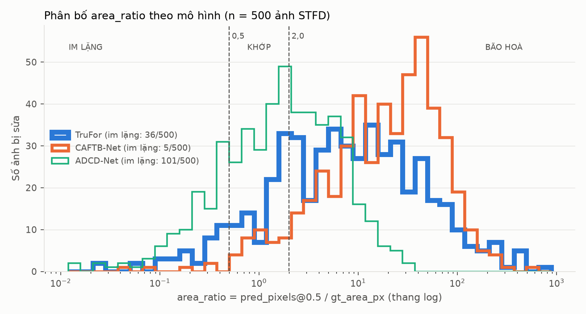
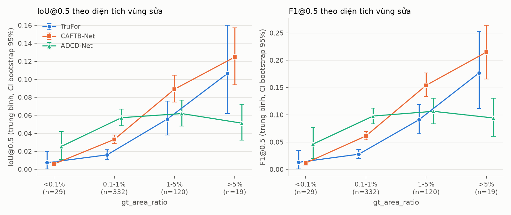
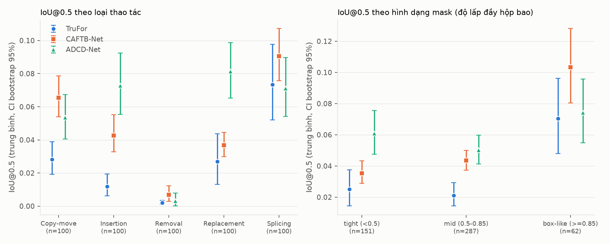
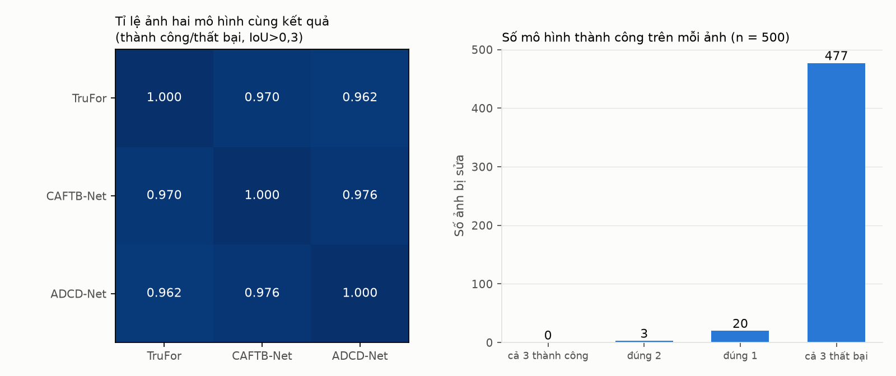

# Phân tích benchmark zero-shot THẬT trên STFD (TruFor, CAFTB-Net, ADCD-Net)

Đây là lượt chạy **thật** đầu tiên: 500 ảnh STFD (100 ảnh/loại thao tác, seed 0), ảnh và mask hạ về lưới
đánh giá chung ≤ 2 MP (giữ tỉ lệ khung hình), TruFor chạy cả ảnh, CAFTB-Net/ADCD-Net chạy cửa sổ trượt
512×512 bước 256. Không đảo cực bản đồ dự đoán. 1.500/1.500 dòng, 0 lỗi. Toàn bộ số liệu ở
`benchmark_tables_stfd.json`; hình ở `figures_stfd/`. Kết quả `forensichub_benchmark_results.csv` (mô hình
giả `np.random.rand`) trong `benchmark_analysis.md` không liên quan tới báo cáo này.

**STFD không có ảnh sạch** (đã xác nhận ở audit trước): FPR mức ảnh không tính được ở lượt này. Mọi chỗ
"tỉ lệ pixel ngoài vùng sửa bị gắn cờ" (`fp_rate_outside_05`) chỉ là chẩn đoán thay thế, không phải FPR.

## Tóm tắt

- **CAFTB-Net bão hoà rõ nhất: 92,0% ảnh (460/500) rơi vào chế độ BÃO HOÀ**, gắn cờ trung bình 9,6% pixel ngoài vùng sửa trên mọi loại thao tác gần như đều nhau (9,2–9,8%) — đúng như giả thuyết "gắn cờ mọi nét chữ". TruFor bão hoà 76,6%, ADCD-Net 46,0%.
- **TruFor không phải mô hình "im lặng nhất" — ADCD-Net mới là.** ADCD-Net có 20,2% ảnh IM LẶNG (cao nhất), TruFor chỉ 7,2%. Giả thuyết "TruFor im lặng" **bị bác bỏ** theo đúng nghĩa area_ratio; TruFor lại thiên về bão hoà.
- **Removal (xóa+vá bằng inpainting) gần như không phát hiện được bởi cả 3 mô hình**: ROC-AUC trung vị 0,48 (TruFor), 0,59 (CAFTB-Net), 0,47 (ADCD-Net) — bằng hoặc dưới mức ngẫu nhiên. **Toàn bộ 9/500 ảnh mà cả ba mô hình cùng cho IoU chính xác bằng 0 đều là ảnh Removal.** Đây là khó khăn thuộc về miền dữ liệu, không phải yếu điểm riêng một kiến trúc.
- **Xu hướng "hộp dễ phát hiện hơn sát nét chữ" quan sát được nhưng phần lớn là do diện tích, không phải hình dạng.** IoU tăng theo độ lấp đầy hộp bao (tight → box-like: 0,021–0,061 → 0,047–0,103), nhưng sau khi loại bỏ ảnh hưởng của `gt_area_ratio` (tương quan riêng phần trên hạng), tương quan hình dạng↔IoU gần như bằng 0 hoặc âm nhẹ (−0,04 đến −0,12) ở cả 3 mô hình. Giả thuyết 3 vì vậy chỉ được xác nhận một phần.
- **Hiệu năng thấp ở cả ba, đồng thuận yếu**: tỉ lệ thành công (IoU > 0,3) chỉ 1,4–2,0%, khoảng tin cậy ba mô hình chồng lên nhau hoàn toàn (McNemar không có cặp nào có ý nghĩa, p = 0,61–1,00). ADCD-Net chậm nhất (23 s/ảnh, có 5,8 s là OCR trên CPU) và tốn VRAM nhất (3,07 GB đỉnh, sát trần 4 GB).

## A. Hiệu năng cơ bản (n = 500)

Trung bình [CI bootstrap 95%]:

| Mô hình | IoU@0.5 | F1@0.5 | PR-AUC | ROC-AUC | Thành công (IoU>0,3) |
|---|---|---|---|---|---|
| TruFor | 0,028472 [0,022475; 0,035280] | 0,047691 [0,038645; 0,057694] | 0,053931 [0,044110; 0,064724] | 0,705054 [0,688104; 0,721386] | 10/500 = 2,0% (Wilson 1,1–3,6%) |
| CAFTB-Net | 0,048447 [0,043030; 0,054119] | 0,086488 [0,077910; 0,095440] | 0,169030 [0,155879; 0,182669] | 0,838634 [0,824314; 0,852477] | 7/500 = 1,4% (Wilson 0,7–2,9%) |
| ADCD-Net | 0,056353 [0,049380; 0,063806] | 0,096695 [0,085698; 0,108210] | 0,097748 [0,087303; 0,108759] | 0,785991 [0,768990; 0,802996] | 9/500 = 1,8% (Wilson 0,9–3,4%) |

**McNemar chính xác** (thành công IoU>0,3, hai phía) — không cặp nào có ý nghĩa:

| Cặp | cả 2 thành công | chỉ mô hình 1 | chỉ mô hình 2 | cả 2 thất bại | p |
|---|---|---|---|---|---|
| TruFor vs CAFTB-Net | 1 | 9 | 6 | 484 | 0,607 |
| TruFor vs ADCD-Net | 0 | 10 | 9 | 481 | 1,000 |
| CAFTB-Net vs ADCD-Net | 2 | 5 | 7 | 486 | 0,774 |

**So sánh ghép cặp trên IoU/F1/PR-AUC/ROC-AUC liên tục** (bootstrap 95%, chẩn đoán bổ sung — chênh lệch trung bình nhỏ nhưng có ý nghĩa vì n=500 lớn, khoảng tin cậy hẹp):

| Cặp | ΔIoU | ΔF1 | ΔPR-AUC | ΔROC-AUC |
|---|---|---|---|---|
| TruFor − CAFTB-Net | −0,0200 [−0,0266; −0,0130]* | −0,0388 [−0,0489; −0,0284]* | −0,1151 [−0,1291; −0,1008]* | −0,1336 [−0,1478; −0,1193]* |
| TruFor − ADCD-Net | −0,0279 [−0,0366; −0,0193]* | −0,0490 [−0,0621; −0,0358]* | −0,0438 [−0,0559; −0,0317]* | −0,0809 [−0,0954; −0,0660]* |
| CAFTB-Net − ADCD-Net | −0,0079 [−0,0152; −0,0011]* | −0,0102 [−0,0214; 0,0003] (không có ý nghĩa) | +0,0713 [+0,0605; +0,0820]* | +0,0526 [+0,0440; +0,0617]* |

*có ý nghĩa (khoảng không chứa 0). Đọc thận trọng: đây là chênh lệch trên chỉ số liên tục (nhạy với bão hoà/im lặng nhẹ), khác với "thành công nhị phân" ở McNemar (không có ý nghĩa). ADCD-Net và CAFTB-Net có IoU/F1 cao hơn TruFor một cách nhất quán nhưng biên độ nhỏ (0,01–0,05); CAFTB-Net vượt trội về PR-AUC/ROC-AUC nhờ xếp hạng xác suất tốt hơn dù bị bão hoà ở τ=0,5.

## B. Chế độ hỏng

`area_ratio_05 = pred_pixels_05 / gt_area_px`. Ngưỡng: IM LẶNG < 0,5; KHỚP 0,5–2,0; BÃO HOÀ > 2,0.

| Mô hình | IM LẶNG | KHỚP | BÃO HOÀ | area_ratio min/trung vị/max |
|---|---|---|---|---|
| TruFor | 36 (7,2%; Wilson 5,2–9,8%) | 81 (16,2%; 13,2–19,7%) | 383 (76,6%; 72,7–80,1%) | 0,022 / 7,530 / 878,8 |
| CAFTB-Net | 5 (1,0%; 0,4–2,3%) | 35 (7,0%; 5,1–9,6%) | **460 (92,0%; 89,3–94,1%)** | 0,044 / 20,298 / 560,5 |
| ADCD-Net | **101 (20,2%; 16,9–23,9%)** | 169 (33,8%; 29,8–38,1%) | 230 (46,0%; 41,7–50,4%) | 0,000 / 1,770 / 32,1 |

**Chẩn đoán thay thế cho FPR mức ảnh** (STFD không có ảnh sạch): tỉ lệ pixel *ngoài* vùng sửa bị gắn cờ trên ảnh bị sửa (`fp_rate_outside_05`):

| Mô hình | trung vị [CI95] | trung bình [CI95] | %ảnh có >1% pixel nền bị gắn cờ | %pixel ảnh bị gắn cờ (trung vị) |
|---|---|---|---|---|
| TruFor | 3,62% [3,27; 4,32] | 8,25% [7,19; 9,42] | 410/500 = 82% | 3,88% |
| CAFTB-Net | 9,46% [9,06; 9,96] | 9,65% [9,25; 10,05] | 492/500 = 98,4% | 9,82% |
| ADCD-Net | 0,77% [0,72; 0,86] | 0,98% [0,92; 1,05] | 185/500 = 37% | 0,89% |

CAFTB-Net gắn cờ nền gần như đồng đều bất kể loại thao tác (9,2–9,8% theo cả 5 loại), phù hợp với hành vi "gắn cờ mọi nét chữ" không phân biệt ngữ cảnh. ADCD-Net thận trọng nhất.



## C. Khoảng lệch hiệu chỉnh

> Oracle-F1 dùng ground truth để chọn ngưỡng tốt nhất cho từng ảnh trên 50 ngưỡng cách đều — **chỉ là chẩn đoán/cận trên, không phải kết quả.**

| Mô hình | gap trung vị [CI95] | Oracle-F1 trung vị (chẩn đoán) | F1@0,5 trung vị | τ* trung vị | Kết luận |
|---|---|---|---|---|---|
| TruFor | 0,0169 [0,0151; 0,0195] | 0,0294 | 0,0000 | 0,133 | **sụp biểu diễn** (oracle cũng thấp) |
| CAFTB-Net | 0,0130 [0,0116; 0,0147] | 0,0792 | 0,0548 | 0,878 | **sụp biểu diễn** (oracle cũng thấp) |
| ADCD-Net | 0,0470 [0,0414; 0,0547] | 0,1275 | 0,0456 | 0,224 | trung gian (gap lớn hơn, oracle cao hơn nhưng vẫn < 0,3) |

Không mô hình nào đạt ngưỡng "lệch ngưỡng, cứu được bằng hiệu chỉnh" (oracle ≥ 0,3) theo quy ước đã đặt trước khi xem số liệu. ADCD-Net có gap lớn nhất và oracle cao nhất trong ba, nên hiệu chỉnh ngưỡng có tiềm năng cải thiện nó nhiều nhất, nhưng trần vẫn thấp (0,13).

**Phân bố τ\*** — chỉ CAFTB-Net dồn rõ về hai biên (64 ảnh τ\*=0, 245 ảnh trong khoảng 0,9–1,0, trong đó 75 ảnh τ\*≥0,98): khớp với việc xác suất CAFTB-Net thường ở cực trị (gần 0 hoặc gần 1) — hệ quả của bão hoà. TruFor và ADCD-Net dồn về biên **dưới** (34 và 59 ảnh τ\*=0) nhưng không có ảnh nào τ\*≥0,98.

## D. Phân tầng

### D1. Theo `gt_area_ratio`

| Khoảng | n | TruFor IoU | CAFTB-Net IoU | ADCD-Net IoU |
|---|---:|---|---|---|
| <0,1% | 29 | 0,0073 [0,0005;0,0198] | 0,0059 [0,0041;0,0079] | 0,0254 [0,0107;0,0420] |
| 0,1–1% | 332 | 0,0160 [0,0111;0,0217] | 0,0331 [0,0288;0,0381] | 0,0573 [0,0484;0,0668] |
| 1–5% | 120 | 0,0558 [0,0380;0,0759] | 0,0890 [0,0749;0,1044] | 0,0619 [0,0479;0,0767] |
| >5% | 19 | 0,1064 [0,0619;0,1600] | 0,1246 [0,0940;0,1570] | 0,0512 [0,0322;0,0724] |

Xu hướng: TruFor và CAFTB-Net tăng **đơn điệu** theo diện tích (Spearman IoU~area: 0,407 và 0,647, p<1e-20). **ADCD-Net không đơn điệu**: đạt đỉnh ở 1–5% (0,062) rồi *giảm* ở >5% (0,051) — tương quan yếu hơn hẳn (Spearman 0,201). Khoảng <0,1% và >5% chỉ có 19–29 ảnh, CI rộng.



### D2. Theo loại thao tác (nhãn thật của STFD)

| Loại | n | TruFor IoU | CAFTB-Net IoU | ADCD-Net IoU | TruFor ROC-AUC | CAFTB ROC-AUC | ADCD ROC-AUC |
|---|---:|---|---|---|---|---|---|
| Copy-move | 100 | 0,0282 [0,0191;0,0388] | 0,0654 [0,0539;0,0787] | 0,0535 [0,0406;0,0672] | 0,7248 | 0,8553 | 0,8199 |
| Insertion | 100 | 0,0119 [0,0063;0,0193] | 0,0427 [0,0327;0,0552] | 0,0728 [0,0554;0,0923] | 0,7670 | **0,9538** | 0,9228 |
| **Removal** | 100 | **0,0020** [0,0009;0,0034] | **0,0068** [0,0029;0,0124] | **0,0030** [0,0001;0,0078] | **0,4777** | **0,5913** | **0,4703** |
| Replacement | 100 | 0,0269 [0,0131;0,0437] | 0,0367 [0,0299;0,0444] | 0,0814 [0,0652;0,0988] | 0,7860 | 0,9511 | 0,9351 |
| Splicing | 100 | 0,0734 [0,0521;0,0977] | 0,0906 [0,0757;0,1073] | 0,0711 [0,0540;0,0897] | 0,7698 | 0,8418 | 0,7819 |

**Removal là loại khó nhất tuyệt đối cho cả ba mô hình**, và với TruFor và ADCD-Net, ROC-AUC trung vị **dưới hoặc bằng 0,5** — nghĩa là trên tập con này, xếp hạng xác suất của hai mô hình đó *không tốt hơn ngẫu nhiên*, không chỉ ngưỡng τ=0,5 chưa phù hợp. Splicing dễ nhất cho TruFor và CAFTB-Net; Insertion/Replacement dễ nhất về ROC-AUC cho CAFTB-Net và ADCD-Net (0,92–0,95) nhưng IoU@0,5 vẫn thấp (0,01–0,08) — xác suất xếp hạng đúng nhưng ngưỡng 0,5 không tối ưu.

**9/500 ảnh mà cả ba mô hình cùng cho IoU chính xác bằng 0 đều là Removal** — xem mục E và G.

### D3. Theo theme (ước lượng)

| Theme | n | TruFor IoU | CAFTB-Net IoU | ADCD-Net IoU |
|---|---:|---|---|---|
| Dark | 45 | 0,0756 [0,0428;0,1165] | 0,1143 [0,0808;0,1508] | 0,0851 [0,0600;0,1137] |
| Light | 455 | 0,0238 [0,0182;0,0301] | 0,0419 [0,0375;0,0466] | 0,0535 [0,0462;0,0609] |

Cả ba mô hình có IoU cao hơn trên ảnh Dark, nhưng n=45 (9% mẫu) nên CI rộng và gần chạm CI của Light — không kết luận chắc chắn. `theme` chỉ là ước lượng theo độ sáng, không phải nhãn gốc.

### D4. Theo độ phân giải

| Độ phân giải | n | TruFor IoU | CAFTB-Net IoU | ADCD-Net IoU |
|---|---:|---|---|---|
| 1080×2340 | 348 | 0,0268 | 0,0503 | 0,0559 |
| 1080×2400 | 63 | 0,0316 | 0,0271 | 0,0672 |
| 750×1334 | 16 | 0,0259 | 0,0756 | 0,0355 |
| khác (12 độ phân giải khác) | 73 | 0,0342 | 0,0519 | 0,0536 |

Không có xu hướng nhất quán theo độ phân giải; khác biệt nằm trong nhiễu (n nhỏ ở 3 nhóm cuối). Ghi nhận thêm: 479/500 ảnh (95,8%) bị hạ độ phân giải để về lưới ≤2 MP (scale trung vị 0,890, nhỏ nhất 0,734).

### D5. Theo hình dạng mask (độ lấp đầy hộp bao) — kiểm chứng trực tiếp giả thuyết 3

`comp_fill_weighted` = Σ diện tích thành phần liên thông / Σ diện tích hộp bao từng thành phần (từ `stfd_stats.csv`, audit trước). tight <0,5 (ôm sát nét chữ) — mid 0,5–0,85 — box-like ≥0,85 (gần hộp).

| Nhóm | n | TruFor IoU | CAFTB-Net IoU | ADCD-Net IoU |
|---|---:|---|---|---|
| tight (<0,5) | 151 | 0,0251 [0,0143;0,0376] | 0,0354 [0,0288;0,0432] | 0,0608 [0,0474;0,0754] |
| mid (0,5–0,85) | 287 | 0,0212 [0,0144;0,0293] | 0,0435 [0,0374;0,0501] | 0,0502 [0,0414;0,0597] |
| box-like (≥0,85) | 62 | 0,0704 [0,0479;0,0963] | 0,1032 [0,0805;0,1282] | 0,0742 [0,0550;0,0957] |

Chiều hướng thô: box-like > tight cho cả ba mô hình (khớp giả thuyết 3). **Nhưng** `comp_fill_weighted` và `gt_area_ratio` tương quan Spearman 0,495 (p<1e-30) — mask dạng hộp trong STFD có xu hướng lớn hơn mask ôm nét chữ (phân bố theo loại: Splicing có 39/100 ảnh box-like, Insertion có 0/100). Sau khi loại ảnh hưởng của diện tích (phần dư hạng của IoU và của fill sau khi hồi quy tuyến tính theo hạng diện tích), tương quan riêng phần IoU↔hình dạng là:

| Mô hình | ρ riêng phần (IoU, hình dạng \| diện tích) |
|---|---|
| TruFor | −0,037 |
| CAFTB-Net | −0,117 |
| ADCD-Net | −0,058 |

Tất cả xấp xỉ 0 hoặc âm nhẹ. **Kết luận: xu hướng "hộp dễ phát hiện hơn" trong dữ liệu này chủ yếu là do mask dạng hộp lớn hơn, không phải vì hình dạng hộp tự thân dễ phát hiện.** Giả thuyết 3 được xác nhận một phần (đúng ở mức tương quan thô, không đúng khi kiểm soát diện tích).



## E. Đồng thuận giữa các mô hình

Ở ngưỡng thành công IoU>0,3 (theo đặc tả), thành công quá hiếm (1,4–2,0%) nên phân bố gần như chỉ có "cả 3 thất bại":

| | cả 3 thành công | đúng 2 | đúng 1 | cả 3 thất bại |
|---|---:|---:|---:|---:|
| IoU>0,3 (theo đặc tả) | 0 | 3 | 20 | 477 |
| IoU>0,1 (bổ sung, ngoài đặc tả — để có đủ tín hiệu) | 9 | 38 | 102 | 351 |

Ma trận phi (nhị phân thành công/thất bại, IoU>0,3): TruFor–CAFTB 0,105, TruFor–ADCD −0,019, CAFTB–ADCD 0,240 — yếu, gần như độc lập ở ngưỡng nghiêm ngặt này.

Tương quan Spearman trên IoU liên tục: TruFor–CAFTB 0,433, TruFor–ADCD 0,340, CAFTB–ADCD 0,553 (đều p<1e-15) — có tương quan dương vừa phải. Sau khi loại bỏ ảnh hưởng của `gt_area_ratio` (tương quan riêng phần trên hạng): TruFor–CAFTB 0,243, TruFor–ADCD 0,289, CAFTB–ADCD 0,566 — **giảm nhưng vẫn dương**, nghĩa là một phần sự đồng thuận đến từ đặc điểm ảnh dùng chung (diện tích), nhưng còn lại một phần đồng thuận không giải thích được bằng diện tích — nhất quán với việc Removal (mục D2) khó với cả ba mô hình vì đặc điểm miền dữ liệu (nội dung ảnh bị inpainting, không để lại manh mối RGB/nén rõ), không phải trùng hợp ngẫu nhiên.

**Bằng chứng trực tiếp nhất cho "khó khăn thuộc về miền dữ liệu":** 9/500 ảnh có cả ba mô hình cùng cho IoU **chính xác bằng 0** — toàn bộ 9 ảnh này đều thuộc loại **Removal**, diện tích vùng sửa từ 0,07% đến 3,5% (không phải toàn bộ đều siêu nhỏ). Đây là bằng chứng rõ nhất rằng có một tập con ảnh (Removal, vá bằng inpainting che khuất manh mối) mà cả ba kiến trúc khác nhau đều thất bại hoàn toàn, ủng hộ giả thuyết "khó khăn miền dữ liệu" hơn là "yếu điểm kiến trúc riêng lẻ" — dù đồng thời TruFor/CAFTB-Net/ADCD-Net vẫn có khác biệt hành vi rõ (mục B, C) cho thấy cả hai cơ chế cùng tồn tại.



## F. Vận hành

| Mô hình | Thời gian suy luận trung vị | Tứ phân vị 25–75 | VRAM đỉnh (trung vị = max, vì batch cố định) |
|---|---|---|---|
| TruFor | 3.916,8 ms | 3.900,9–4.471,6 ms | 2.867,3 MB |
| CAFTB-Net | 2.293,8 ms | 2.285,5–2.330,8 ms | 1.470,8 MB |
| ADCD-Net | 22.897,3 ms (gồm OCR) | 22.787,0–23.077,9 ms | 3.067,6 MB |

- **ADCD-Net riêng phần OCR (PaddleOCR, chạy trên CPU)**: trung vị 5.845,7 ms — chiếm khoảng 1/4 thời gian mỗi ảnh của ADCD-Net.
- **Resize đầu vào**: có, ở lưới đánh giá chung (≤2 MP, `cv2.INTER_AREA`, giữ tỉ lệ khung hình) trước khi đưa vào bất kỳ mô hình nào — 479/500 ảnh (95,8%) bị hạ độ phân giải, scale trung vị 0,890. Ngoài ra CAFTB-Net và ADCD-Net còn cắt cửa sổ 512×512 (không resize thêm, chỉ cắt/đệm), TruFor nhận cả ảnh ở lưới đánh giá.
- **VRAM 4 GB sát trần**: ADCD-Net đỉnh 3,07 GB — nếu chạy song song việc khác trên GPU dễ tràn bộ nhớ.

## G. Kiểm tra tính hợp lệ

**G1. Ảnh mà cả 3 mô hình cho IoU = 0 chính xác:** có — 9/500 (1,8%), **toàn bộ đều là loại Removal** (xem mục E, danh sách đầy đủ trong `data/pilot_...` không lưu riêng nhưng tái tạo được bằng lệnh ở mục Tái tạo). Không phải lỗi pipeline: `diện tích vùng sửa` của các ảnh này (0,07–3,5%) nằm trong phạm vi bình thường, không phải 0; nghĩa là mô hình thật sự dự đoán trật hoàn toàn khỏi vùng sửa, không phải lỗi đọc mask.
- Riêng từng mô hình, tỉ lệ IoU=0 khác nhau rất nhiều: **TruFor 252/500 (50,4%)**, ADCD-Net 163/500 (32,6%), **CAFTB-Net chỉ 19/500 (3,8%)** — khớp với việc CAFTB-Net gần như luôn gắn cờ diện tích lớn (mục B) nên hiếm khi trật hoàn toàn, còn TruFor/ADCD-Net thận trọng hơn nên dễ trật hẳn khi tín hiệu yếu.
- Theo loại thao tác, tỉ lệ IoU=0 của TruFor: Copy-move 39%, Insertion 49%, **Removal 81%**, Replacement 54%, Splicing 29%; của ADCD-Net: Copy-move 25%, Insertion 20%, **Removal 85%**, Replacement 16%, Splicing 17%. Removal vượt trội hẳn ở cả hai mô hình.

**G2. ROC-AUC so với PR-AUC — chênh lệch lớn, đúng như dự đoán do mất cân bằng lớp:**

| Mô hình | ROC-AUC trung vị | PR-AUC trung vị | Tỉ lệ dương trung vị (`gt_area_ratio`) |
|---|---|---|---|
| TruFor | 0,741 | 0,011 | 0,00404 |
| CAFTB-Net | 0,904 | 0,131 | 0,00404 |
| ADCD-Net | 0,857 | 0,048 | 0,00404 |

ROC-AUC trông "khá tốt" (0,74–0,90) trong khi PR-AUC rất thấp (0,01–0,13), chênh lệch 7–70 lần — dấu hiệu kinh điển của mất cân bằng lớp cực độ (vùng sửa chỉ ~0,4% pixel trung vị). **Không nên dùng ROC-AUC một mình để đánh giá mô hình trên STFD**; PR-AUC hoặc F1/IoU@ngưỡng phù hợp hơn.

**G3. Phân bố τ\* có dồn về biên không?** Có, nhưng khác nhau theo mô hình (xem mục C): CAFTB-Net dồn về **cả hai biên** (64 ảnh τ\*=0, 245 ảnh τ\*∈[0,9;1,0]); TruFor và ADCD-Net dồn chủ yếu về biên **dưới** (34 và 59 ảnh τ\*=0, không ảnh nào τ\*≥0,98).

**G4. Kiểm tra "có phải đầu ra ngẫu nhiên không?"** (đối chứng bắt buộc sau lần trước dùng dữ liệu giả) — **bác bỏ ở cả ba mô hình**: `any_random_like = false`. Sai lệch tương đối trung vị so với kỳ vọng của bộ dự đoán ngẫu nhiên đều: IoU lệch 100–492% (TruFor 100%, ADCD-Net 141%, CAFTB-Net 492%), và ROC-AUC trung vị (0,74–0,90) lệch xa 0,5. Ba mô hình cho ba hành vi khác nhau rõ rệt (mục B, C), khác hẳn với lần chạy giả trước đó (mọi số liệu trùng khít giữa 3 "mô hình").

## Giả thuyết được xác nhận / bị bác bỏ

| Giả thuyết | Dữ liệu thật nói gì | Kết luận |
|---|---|---|
| **TruFor im lặng** (bỏ sót vùng bị sửa) | TruFor có tỉ lệ IM LẶNG thấp nhất trong ba (7,2%), và bão hoà là chế độ chiếm đa số (76,6%). TruFor **có** khác biệt so với CAFTB-Net và ADCD-Net (IoU thấp hơn có ý nghĩa, mục A), và 50,4% ảnh có IoU chính xác 0 — nhưng đó là do dự đoán trật vị trí (bão hoà lệch chỗ) chứ không phải vì dự đoán quá ít pixel. | **BỊ BÁC BỎ** theo đúng định nghĩa area_ratio. TruFor thực sự yếu hơn hai mô hình kia (có ý nghĩa thống kê), nhưng cơ chế là bão hoà/lệch vị trí, không phải im lặng. Mô hình "im lặng nhất" trong ba lại là ADCD-Net. |
| **CAFTB-Net bão hoà** (gắn cờ mọi nét chữ) | 92,0% ảnh BÃO HOÀ (cao nhất trong ba), `fp_rate_outside_05` trung vị 9,46% và gần như hằng định theo loại thao tác (9,2–9,8%), τ\* dồn về cả hai biên, 3,8% ảnh có IoU=0 (thấp nhất — vì luôn phủ diện tích lớn nên hiếm khi trật hẳn). | **ĐƯỢC XÁC NHẬN** (không kiểm chứng riêng trên ảnh sạch vì STFD không có, nhưng mọi chỉ số gián tiếp đều khớp). |
| **Hình dạng vùng vá quyết định khả năng phát hiện** (hộp dễ, sát nét chữ khó) | Tương quan thô: box-like có IoU cao hơn tight ở cả ba mô hình (mục D5). Nhưng sau khi kiểm soát diện tích vùng sửa (tương quan riêng phần), hiệu ứng hình dạng gần như biến mất (−0,04 đến −0,12) — vì mask dạng hộp trong STFD (chủ yếu ở Splicing) có xu hướng lớn hơn mask ôm nét chữ (chủ yếu ở Insertion). Diện tích (mục D1, Spearman 0,20–0,65) là yếu tố chi phối mạnh hơn hình dạng. | **ĐƯỢC XÁC NHẬN MỘT PHẦN**: đúng ở mức quan sát thô, nhưng biến quyết định chính có vẻ là **diện tích vùng sửa**, không phải hình dạng tự thân; hai biến này tương quan chặt với nhau trong STFD nên khó tách bạch dứt khoát chỉ bằng dữ liệu này. |

## Bất thường

1. **Removal gần như không phát hiện được, ROC-AUC ≤ 0,5** cho TruFor (0,478) và ADCD-Net (0,470) — tệ hơn cả đoán ngẫu nhiên trên tập con này. Cần xem lại: Removal trong STFD là xóa chữ + tô lại (inpainting), có thể không để lại manh mối nén/màu mà TruFor (Noiseprint++) và ADCD-Net (DCT) khai thác.
2. **ADCD-Net không đơn điệu theo diện tích** (mục D1): IoU giảm ở khoảng >5% so với 1–5%, ngược chiều với TruFor và CAFTB-Net. Chưa rõ nguyên nhân (có thể do cửa sổ 512×512 cắt nhỏ vùng sửa lớn thành nhiều mảnh, làm giảm hiệu năng ghép).
3. **50,4% ảnh TruFor có IoU chính xác bằng 0** — tỉ lệ rất cao so với CAFTB-Net (3,8%). Cần xem thêm heatmap của TruFor (lưu ở `data/heatmaps/TruFor/`) để biết đây là do dự đoán lệch vị trí hoàn toàn hay do ngưỡng 0,5 không phù hợp với phân bố xác suất của TruFor trên miền STFD (khác miền huấn luyện gốc).
4. **Chênh lệch ROC-AUC/PR-AUC rất lớn** (7–70 lần, mục G2) — nhắc lại cho nhóm: không dùng ROC-AUC làm chỉ số chính khi báo cáo trên STFD.

## Tái tạo

```bash
D:\grp_proj\stfd_env\Scripts\python.exe -X utf8 make_stfd_sample.py            # đã chạy, mẫu 500 ảnh cố định (seed 0)
D:\grp_proj\stfd_env\Scripts\python.exe -X utf8 run_stfd_benchmark.py --models trufor,caftb,adcd --out stfd_benchmark_results.csv
D:\grp_proj\stfd_env\Scripts\python.exe -X utf8 analyze_stfd.py --csv stfd_benchmark_results.csv
```

Số liệu đầy đủ: `benchmark_tables_stfd.json`. Heatmap thu nhỏ từng ảnh/mô hình: `data/heatmaps/<TruFor|CAFTB-Net|ADCD-Net>/<image_id>.png`. Metric đã kiểm chứng khớp `sklearn` (`python stfd_metrics.py`, sai lệch ROC-AUC ≤ 1,4e-6, PR-AUC ≤ 8,4e-6). Bộ giải mã DCT tự viết thay `jpeg2dct` đã kiểm chứng (`python jpeg_coeffs.py`, sai số ≈ nhiễu làm tròn 8-bit).
